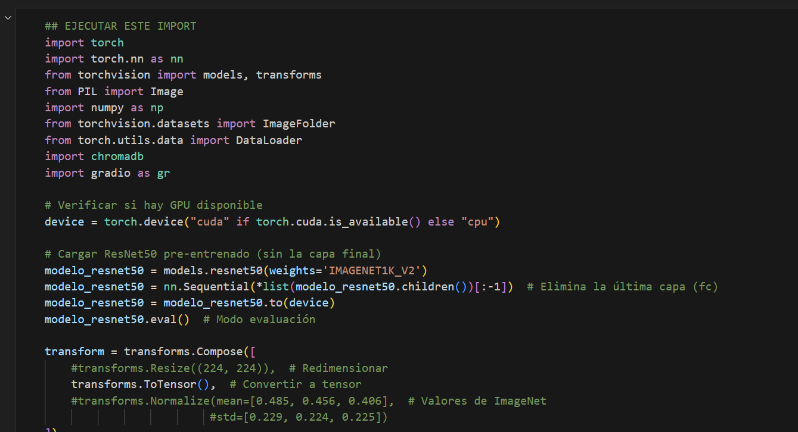
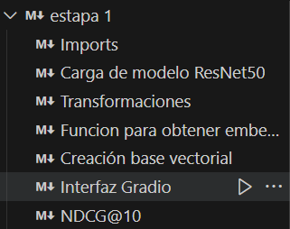
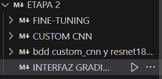
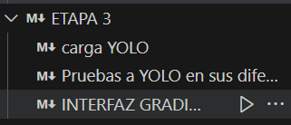

# TP-CV-2025

1- Clone the repo
git clone https://github.com/Gonzaloc-71/TP-CV-2025

2- crear un venv (python -m venv venv)

3- activar venv ./venv/Script/activate

4- pip install requeriments.txt

5- ejecutar la celda que tiene imports y dice ""##EJECUTAR" (Segunda celda) 

6- Ejecutar todas las celdas dentro de cada Markdown donde dice Interfaz Gradio (son 3) estapa (), etapa 2 ()
etapa 3 ()

